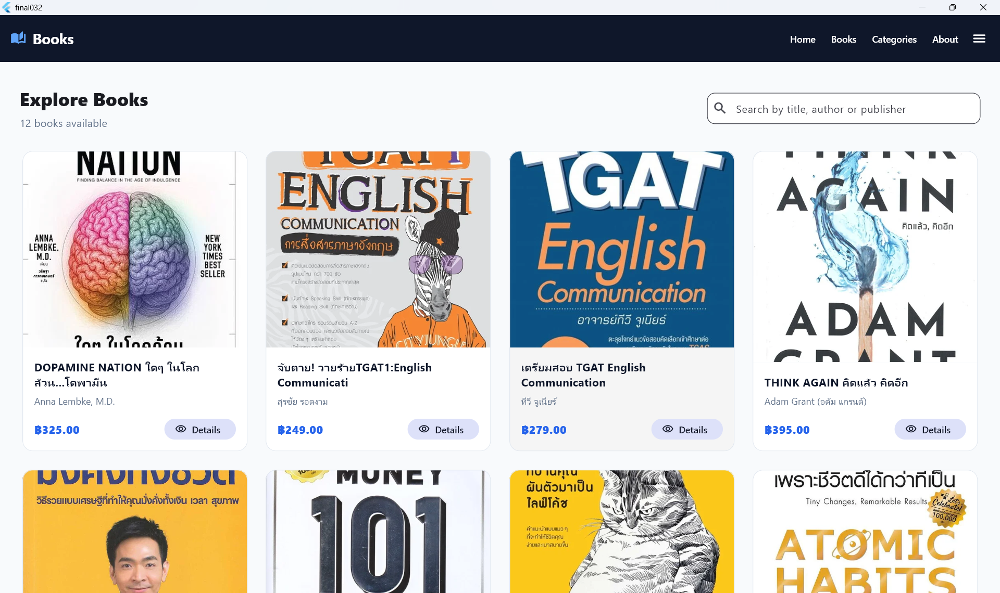
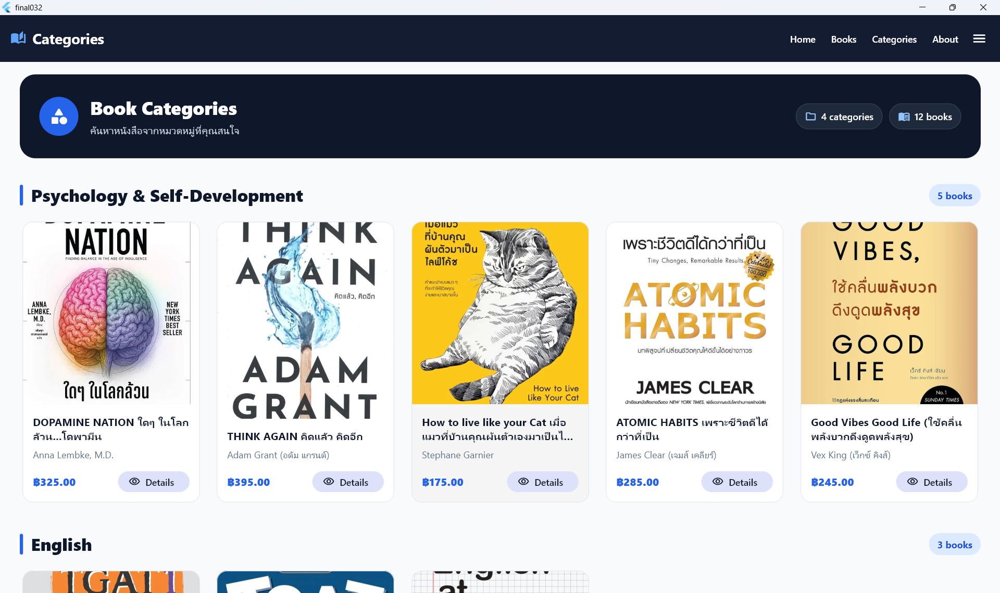
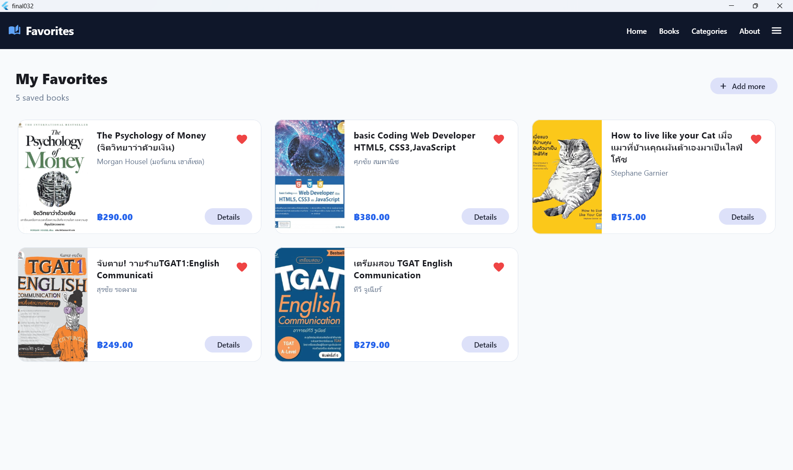
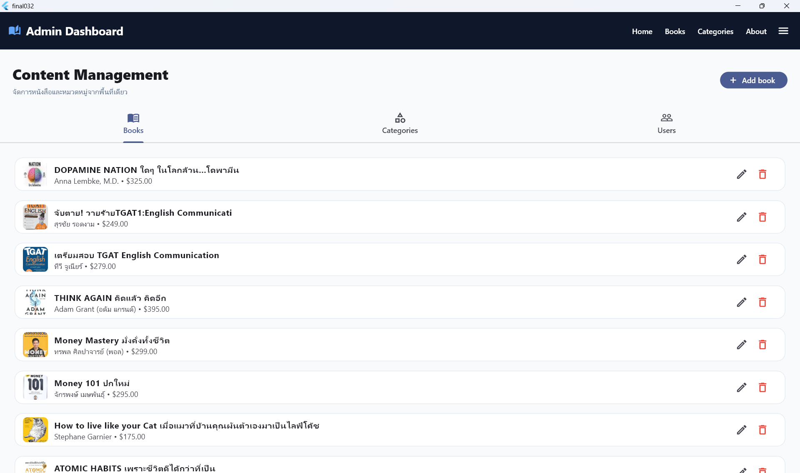
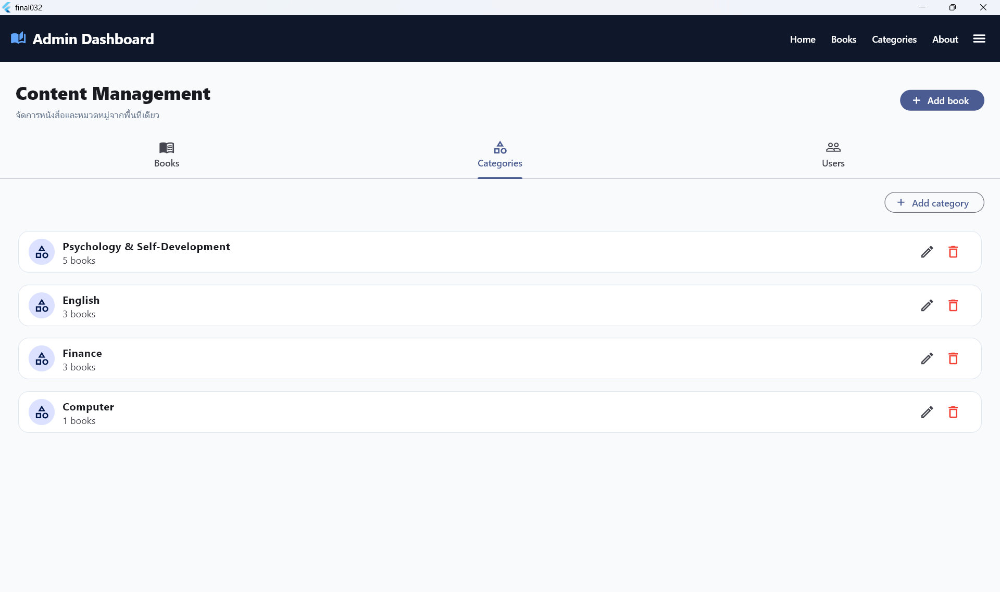
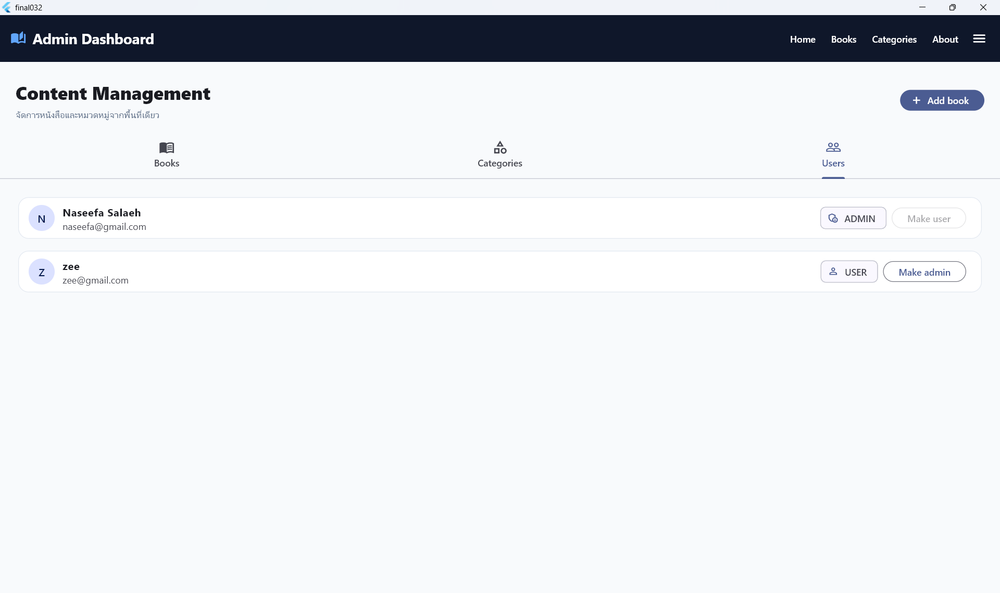
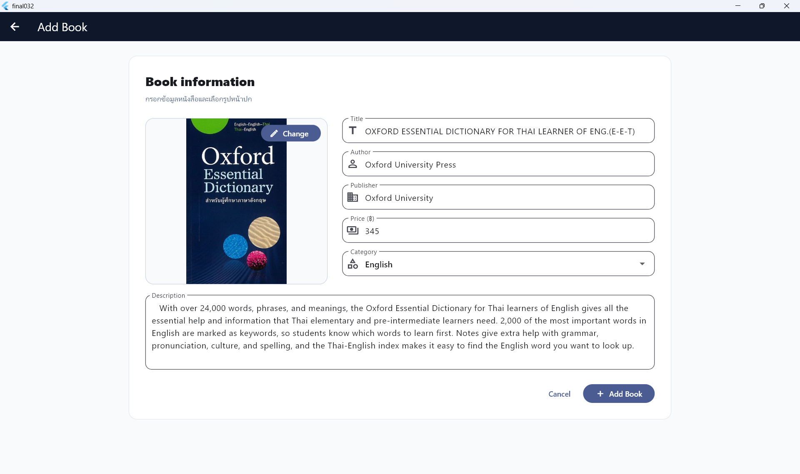

# 📚 BookBuddies

BookBuddies is a full-stack book discovery and management application built with Flutter, PHP, and MySQL. It provides a clean and responsive interface for browsing books, exploring categories, viewing book details, and maintaining a personal favorites collection.

The application includes role-based access, giving administrators a dedicated dashboard for managing books, categories, and user permissions.

## ✨ Key Features

### User Features

- Secure registration and login
- Browse and search books
- Explore books by category
- View detailed book information
- Manage a personal favorites collection
- View profile and account role

### Admin Features

- Add, edit, and delete books
- Upload book cover images
- Create, rename, and delete categories
- Manage users and administrator permissions
- Control content through a dedicated dashboard

## 🖼️ Screenshots

### Home


### Book Collection



### Categories



### Book Details


### Personal Favorites



### Admin Dashboard







### Add Book



## 🛠️ Technology Stack

- **Frontend:** Flutter and Dart
- **Backend:** PHP REST API
- **Database:** MySQL
- **Local Server:** XAMPP
- **State Persistence:** Shared Preferences
- **Networking:** HTTP

## 📁 Project Structure

```text
bookbuddies/
├── api/          # PHP REST API endpoints
├── database/     # MySQL database export
├── images/       # Uploaded book covers
├── lib/          # Flutter source code
├── screenshots/  # Application previews
└── pubspec.yaml  # Flutter configuration
```

## 👤 Author

**Naseefa Salaeh**

## 📌 Status

The core application is complete and operational, including authentication, role-based access, book and category management, and user-specific favorites.